# ZIP

## 🏠 프로젝트 소개

ZIP은 지도 기반 부동산 정보 조회, 관심 매물 관리, 부동산 뉴스 요약, 커뮤니티, AI 매물 추천 기능을 제공하는 부동산 정보 플랫폼입니다.

사용자는 지역별 아파트 매물과 실거래 정보를 지도에서 확인하고, 관심 있는 매물을 저장할 수 있습니다. 또한 주변 편의시설 검색, 최신 부동산 뉴스 확인, 회원 기반 커뮤니티 이용, AI 기반 질의응답과 매물 추천 기능을 통해 부동산 탐색 과정을 더 편리하게 진행할 수 있습니다.

- 개발 기간: 2025.05.02 ~ 2025.05.28
- 플랫폼: Web
- 개발 인원: 2명

### 👥 팀원 구성

|                                                                              |                                                                                 |
| :--------------------------------------------------------------------------: | :-----------------------------------------------------------------------------: |
|  |  |
|                    [배준수](https://github.com/hashilyze)                    |                       [최민석](https://github.com/m0304s)                       |

<br>

## ✨ 주요 기능

### 🗺️ 매물 검색

- 지도 기반 UI에서 아파트 매물 위치를 마커로 확인할 수 있습니다.
- 선택한 지역의 아파트 목록을 사이드바에서 확인할 수 있습니다.
- 매물별 가격, 면적, 거래 이력 등 기본 정보를 제공합니다.
- 지도 확대, 축소 및 현재 위치 이동 기능을 제공합니다.

### ⭐ 관심 매물

- 관심 있는 아파트 매물을 등록할 수 있습니다.
- 내 정보 화면에서 등록한 관심 매물 목록을 조회할 수 있습니다.

### 📍 주변 장소 검색

- 현재 지도 중심을 기준으로 주변 편의시설을 검색할 수 있습니다.
- 은행, 병원, 약국, 학교, 마트, 지하철 등 생활 편의시설을 마커로 확인할 수 있습니다.

### 📰 뉴스

- 최신 부동산 관련 뉴스를 리스트 형태로 제공합니다.
- 뉴스 제목과 썸네일 이미지를 통해 주요 내용을 직관적으로 확인할 수 있습니다.
- 오늘의 뉴스 요약 기능으로 부동산 시장 동향과 주요 이슈를 빠르게 파악할 수 있습니다.

### 🔐 회원 기능

- 회원가입, 로그인, 로그아웃 기능을 제공합니다.
- 아이디 저장 기능으로 로그인 편의성을 높였습니다.
- 이메일 기반 아이디 찾기와 비밀번호 재설정을 지원합니다.
- 내 정보 화면에서 프로필, 관심 매물, 내가 쓴 글, 내가 쓴 댓글을 확인할 수 있습니다.

### 💬 커뮤니티

- 게시글 작성, 조회, 수정, 삭제 기능을 제공합니다.
- 게시글별 댓글 작성, 조회, 수정, 삭제 기능을 제공합니다.

### 🤖 AI 기능

- 부동산 관련 질문과 FAQ를 입력하고 답변을 받을 수 있습니다.
- 지정한 법정동에 속한 매물 중 AI가 최대 3개의 아파트를 추천합니다.

<br>

## 🛠️ 기술 스택

### ⚙️ Backend


### 🖥️ Frontend


<br>

## 🖼️ 주요 화면

### 🏡 메인 화면

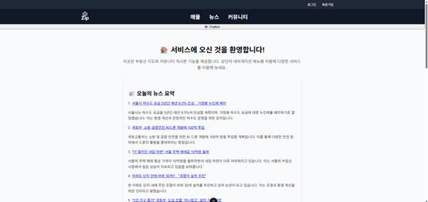

### 🗺️ 매물 검색 화면

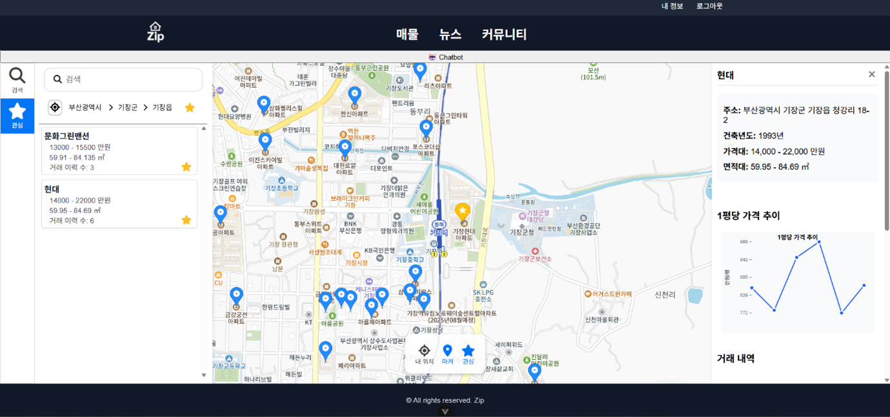

### ⭐ 관심 매물 조회 화면

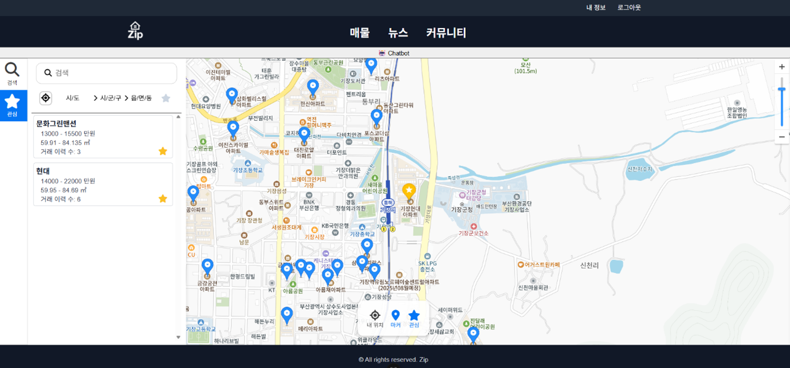

### 📍 주변 장소 검색 화면

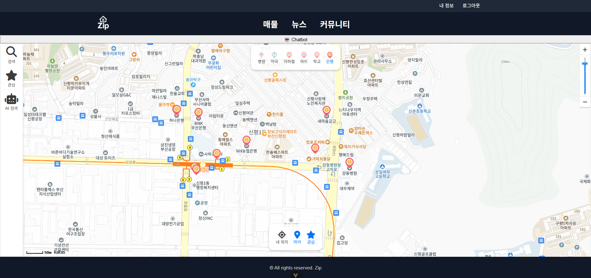

### 📰 뉴스 조회 화면

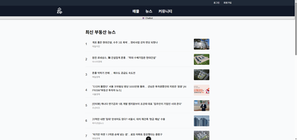

### 🔐 회원 기능 화면

| 로그인                                                                 | 회원가입                                                                          |
| ---------------------------------------------------------------------- | --------------------------------------------------------------------------------- |
| 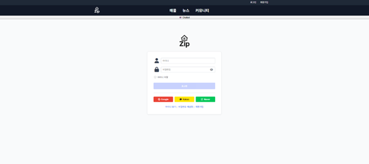        | 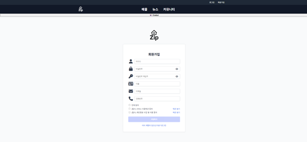                  |
| 아이디 찾기                                                            | 비밀번호 재설정                                                                   |
| 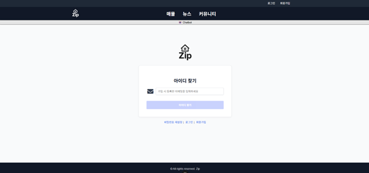 | 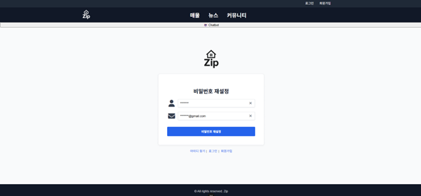 |

### 🤖 AI 기능 화면

| AI 검색                                                              | AI 매물 추천                                                                      |
| -------------------------------------------------------------------- | --------------------------------------------------------------------------------- |
| 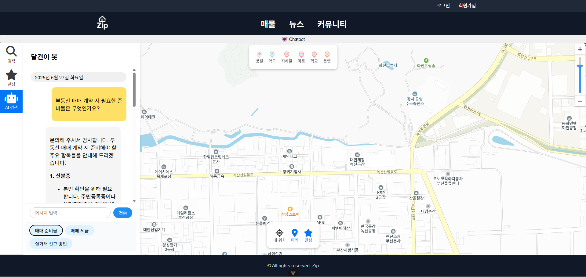 | 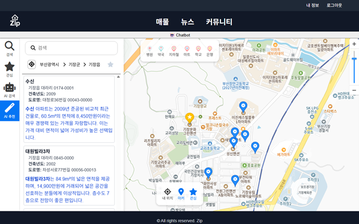 |

<br>

## 📁 프로젝트 구조

```text
zip
├── backend/                         # Spring Boot API 서버
│   ├── src/main/java/com/ssafy/BaeAndChoi
│   │   ├── aws/                     # AWS S3 업로드
│   │   ├── board/                   # 게시판 및 댓글
│   │   ├── chatbot/                 # AI 챗봇
│   │   ├── config/                  # Security, CORS, Swagger, JWT 설정
│   │   ├── email/                   # 이메일 발송
│   │   ├── house/                   # 아파트 및 실거래가
│   │   ├── interest/                # 관심 지역 및 관심 매물
│   │   ├── lwdCd/                   # 법정동 코드
│   │   ├── news/                    # 부동산 뉴스 및 뉴스 요약
│   │   └── user/                    # 회원 및 인증
│   ├── src/main/resources
│   │   ├── application.yml          # 공통 애플리케이션 설정
│   │   └── application-secret.yml   # 로컬 비밀 설정
│   └── build.gradle                 # Gradle 빌드 설정
├── frontend/                        # Vue 3 + Vite 클라이언트
│   ├── public/                      # 정적 리소스
│   ├── src
│   │   ├── assets/                  # 이미지, CSS 등 프론트 리소스
│   │   ├── components/              # 공통 컴포넌트
│   │   ├── constants/               # 약관 및 에러 상수
│   │   ├── plugins/                 # 인증 플러그인
│   │   ├── router/                  # Vue Router 설정
│   │   ├── stores/                  # Pinia 스토어
│   │   ├── utils/                   # 지도, 유효성 검사 등 유틸
│   │   └── views/                   # 페이지 단위 화면
│   ├── package.json                 # npm 스크립트 및 의존성
│   └── vite.config.js               # Vite 설정
├── sql/                             # ssafyhome DB 초기화 SQL
├── docs/images/                     # README 화면 이미지 및 ERD
└── README.md
```

<br>

## 🧩 ERD

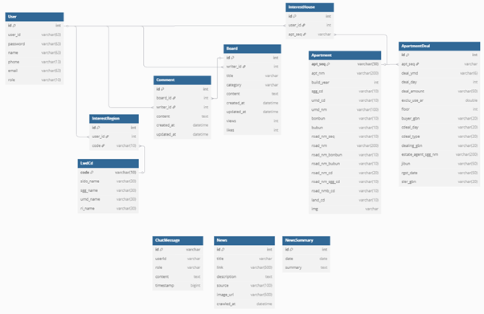

<br>

## 🔗 주요 API 경로

- `POST /api/users/login`: 로그인
- `POST /api/users`: 회원가입
- `GET /api/users/getUserInfo`: 회원 정보 조회
- `POST /api/users/updateUser`: 회원 정보 수정
- `POST /api/users/updatePassword`: 비밀번호 변경
- `POST /api/users/find-id`: 아이디 찾기
- `POST /api/users/reset-password`: 비밀번호 재설정
- `GET /api/apartments/deals`: 아파트 거래 조회
- `GET /api/apartments/apt`: 아파트 조회
- `GET /api/lwdCd/sido`: 시도 코드 조회
- `GET /api/lwdCd/sgg/{code}`: 시군구 코드 조회
- `GET /api/lwdCd/umd/{code}`: 읍면동 코드 조회
- `GET /api/boards`: 게시글 목록 조회
- `POST /api/boards`: 게시글 작성
- `GET /api/boards/{id}`: 게시글 상세 조회
- `GET /api/boards/{boardId}/comments`: 댓글 조회
- `POST /api/boards/{boardId}/comments`: 댓글 작성
- `GET /api/news`: 뉴스 조회
- `GET /api/news/getTodayNewsSummation`: 오늘의 뉴스 요약 조회
- `POST /api/chat`: 챗봇 메시지 전송
- `GET /api/chat/history`: 챗봇 대화 기록 조회
- `POST /api/aws`: S3 이미지 업로드
-
